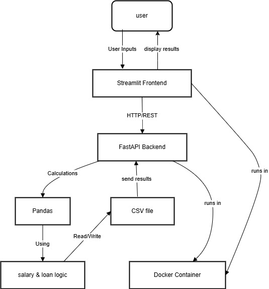

# Salary Calculator

A Streamlit-based web application designed to calculate net salary, assess loan eligibility, and track loan repayments. This project, named `SALARY_CALCULATOR_23`, provides a user-friendly interface for financial planning, featuring a multi-page layout with customer dashboard, loan calculator, and repayment tracking.

## Overview

- **Purpose**: Helps users calculate their net salary based on base salary, allowances, bonuses, and deductions, and determine loan eligibility with EMI (Equated Monthly Installment) calculations and repayment tracking.
- **Features**:
  - Salary calculation with customizable tax rates.
  - Loan eligibility check and EMI comparison.
  - Remaining loan balance visualization over time.
  - Payment recording and tracking in a CSV file.
- **Tech Stack**:
  - Frontend: Streamlit (v1.45.0)
  - Backend: FastAPI (for API calculations)
  - Dependencies: `pandas`, `numpy`, `matplotlib`, `requests`

## Project Structure


## Architecture Diagram



**Description**: The architecture consists of a frontend built with Streamlit, hosted in a Docker container, and a backend powered by FastAPI, also containerized. The frontend communicates with the backend via HTTP requests (e.g., `http://backend:8000/calculate-salary`) to perform salary and loan calculations. Data persistence is handled through CSV files (`payments.csv` and `salary_loan_data.csv`) mounted as volumes. The multi-page navigation is managed by Streamlit’s built-in `pages/` directory structure.

## API Descriptions

The application relies on a FastAPI backend for calculations. Below are the key API endpoints:

- **`/calculate-salary`**:
  - **Method**: `POST`
  - **Description**: Calculates net salary based on input parameters.
  - **Request Body**:
    ```json
    {
      "base_salary": float,
      "allowances": float,
      "bonuses": float,
      "tax_rate": float,
      "deductions": float
    }
    ```
  - **Response**:
    ```json
    {
      "net_salary": float,
      "gross_salary": float,
      "tax": float
    }
    ```

- **`/calculate-loan`**:
  - **Method**: `POST`
  - **Description**: Determines loan eligibility and calculates EMI.
  - **Request Body**:
    ```json
    {
      "net_salary": float,
      "loan_amount": float,
      "loan_tenure": int,
      "annual_interest_rate": float
    }
    ```
  - **Response**:
    ```json
    {
      "emi": float,
      "total_payment": float,
      "interest_paid": float,
      "eligible": bool
    }
    ```

## Pandas Explanation

Pandas is a powerful Python library used in this project for data manipulation and analysis, particularly for handling payment records stored in `payments.csv`.

- **Usage**: 
  - **Data Loading**: `pd.read_csv(payments_file)` loads the `payments.csv` file.
  - **Data Manipulation**: `pd.concat()` and `pd.DataFrame()` are used to append new records.
  - **Aggregation**: `payments_df["amount"].sum()` calculates the total paid amount.

- **Example**:
  ```python
  import pandas as pd
  from datetime import datetime
  payments_df = pd.read_csv("/app/payments.csv")
  new_payment = pd.DataFrame({"date": [datetime.now()], "amount": [100.0]})
  payments_df = pd.concat([payments_df, new_payment], ignore_index=True)
  payments_df.to_csv("/app/payments.csv", index=False)
  ```

## Setup Guide

### Prerequisites
- Docker and Docker Compose installed.
- Python 3.9+ with `pip`.

### Installation
1. Clone the repository:
   ```bash
   git clone https://github.com/your-username/SALARY_CALCULATOR_23.git
   cd SALARY_CALCULATOR_23
   ```
2. Build and run the Docker containers:
   ```bash
   docker-compose up --build
   ```
3. Access the app at `http://localhost:8501`.

### Usage
1. Navigate to `http://localhost:8501/customer`.
2. Enter financial details to calculate salary.
3. Check loan eligibility and track payments.

## Contributing
- Fork the repository.
- Create a feature branch (`git checkout -b feature-name`).
- Commit and push changes.

## License
[MIT License](LICENSE)

## Contact
- **Author**: Abonyo Mitchell Nina
- **Email**: mtchllnina@gmail.com


## Troubleshooting
- **Page Not Found**: Ensure `pages/` is correctly structured.
- **Build Failures**: Check logs for missing files or packages.
